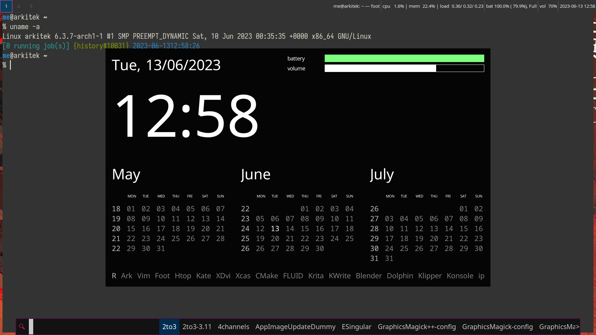

# sway-config
A sane sway config to get you started without any hassle. Perfect for building up.



## Official repository
```
sudo pacman -S --asdeps wl-clipboard wldash wofi mako playerctl wmname autotiling-rs swayidle swaylock swaybg foot bemenu-wayland brightnessctl pactl
```
## AUR Packages

- `wob`
- `swayrbar`
- `swayr`
- `networkmanager-dmenu-git`
- `ttf-iosevka`

## Additional tweaks
Change file `/etc/environment` to include the following:
```
MOZ_ENABLE_WAYLAND=1
QT_QPA_PLATFORM=wayland
QT_QPA_PLATFORMTHEME=kde
```

You may also need to install image viewer and pdf viewer: feh/nomacs and zathura/okular are good enough.
