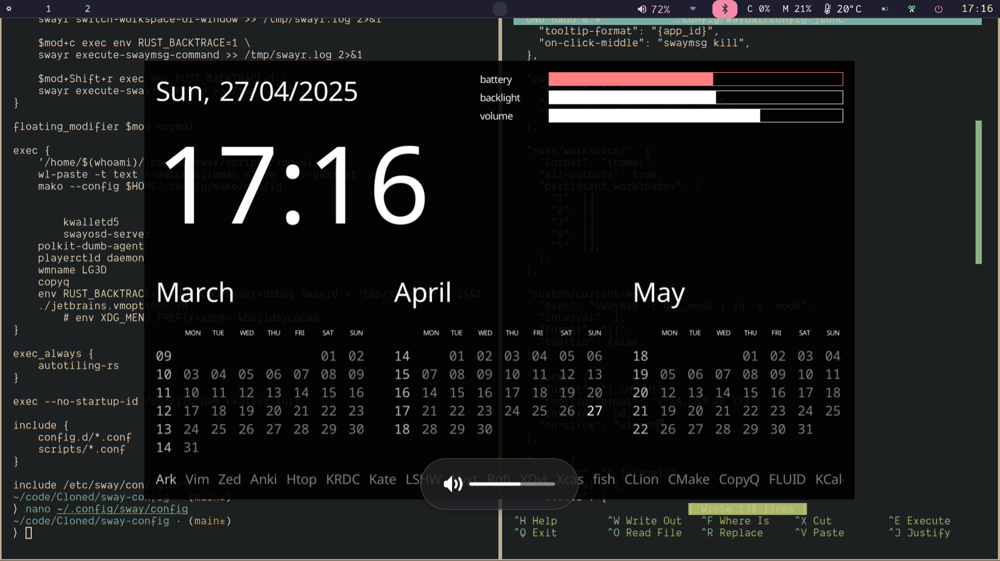

# sway-config
A sane sway config to get you started without any hassle. Perfect for building up.



## Official repository
```
sudo pacman -S --asdeps wl-clipboard wldash wofi mako playerctl wmname autotiling-rs swayidle swaylock swaybg foot bemenu-wayland brightnessctl pactl rofi-wayland xdg-desktop-portal-wlr copyq grim slurp
```
## AUR Packages

```
paru -S wldash wob swayrbar swayr networkmanager-dmenu-git ttf-iosevka sov
```

## Additional tweaks
Change file `/etc/environment` to include the following:
```
MOZ_ENABLE_WAYLAND=1
QT_QPA_PLATFORM=wayland
QT_QPA_PLATFORMTHEME=kde
```

You may also need to install image viewer and pdf viewer: feh/nomacs and zathura/okular are good enough.

```
git clone git@github.com:prirai/sway-config.git
```

This clones the repo, now you can manually copy and paste the folders you want to your config directory (usually `~/.config`). Copy the `fonts` directory to `~/.local/share/fonts` and do `fc-cache -fv`.


## Issues (Not attached to this project)
https://forum.manjaro.org/t/no-apps-in-open-with-dialog-in-dolphin-from-outide-of-plasma/162119
